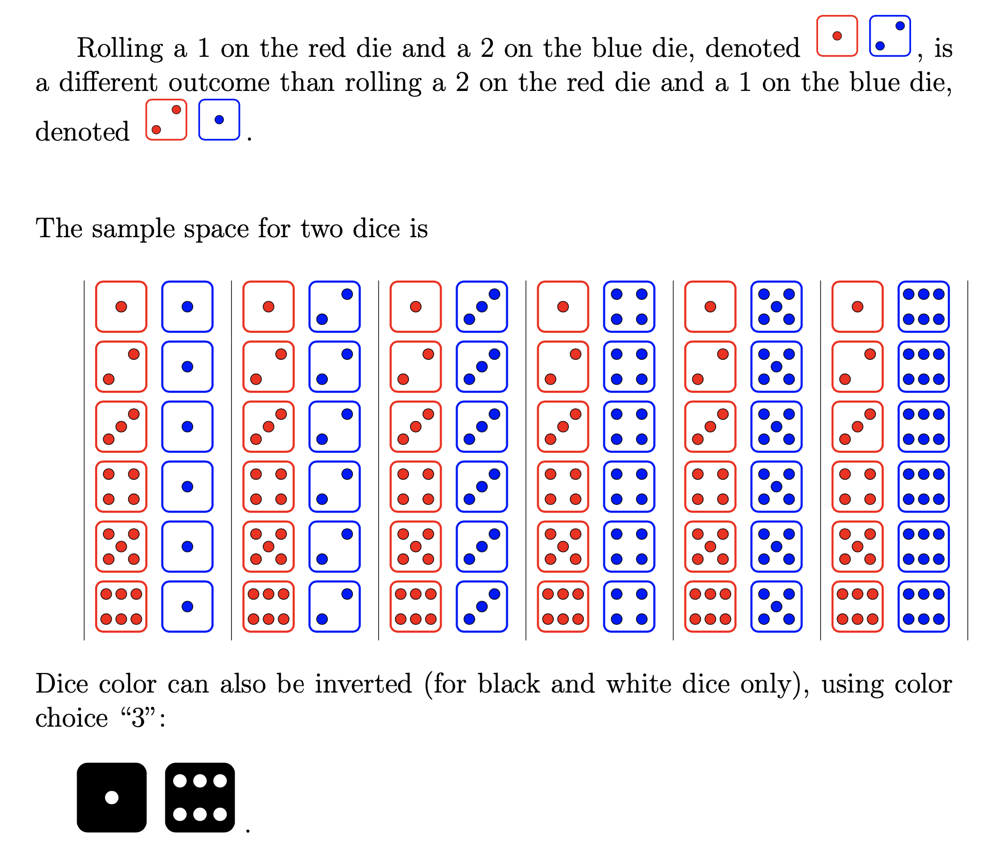
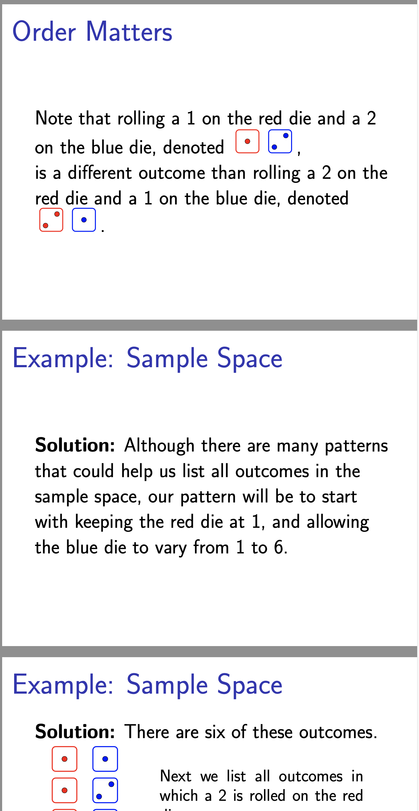

# tikzdice
### A LaTeX/Tikz function library to draw six-sided dice icons in a few colors.

I'm teaching a math/stats/decision-science class and I needed to make some examples using dice. I found a few posts on stackexchange (<a href="https://tex.stackexchange.com/questions/102630/dice-symbols-for-digits-up-to-9
">here</a> and <a href="https://tex.stackexchange.com/questions/431699/how-can-i-use-a-dice-symbol-inside-a-math-equation">here</a>) and it seemed like a straightforward thing to build a simple function library to accommodate my needs. Seemed like a good idea to share.

<table>
  <tr><td border="1px">
    </td>
    <td> A screen capture showing the functionality of the function library.</td>
  </tr>
  </table>

<table>
  <tr><td border="1px">
    </td>
    <td> A screen capture showing a few Beamer slides using the library.</td>
  </tr>
  </table>
